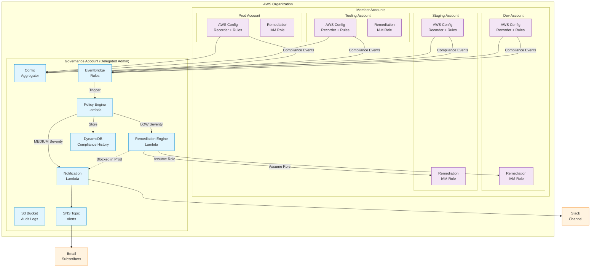

# Cloud Governance Platform - Architecture

## Overview

This platform provides **organization-wide governance** across a multi-account AWS Organization with:
- Centralized compliance monitoring via AWS Config
- Event-driven policy enforcement
- Automated remediation for security violations
- Multi-channel notifications (SNS + Slack)

---

## Architecture Diagram



---

## Event Flow

### 1. Compliance Detection
1. AWS Config detects non-compliant resource in member account
2. Compliance change event published to EventBridge
3. Event forwarded to Governance account's Event Bus

### 2. Policy Engine Processing
1. Policy Engine Lambda receives event
2. Classifies severity: **LOW**, **MEDIUM**, or **HIGH**
3. Stores record in DynamoDB (idempotent)
4. Routes based on severity

### 3. Remediation (LOW Severity)
| Rule | Action |
|------|--------|
| `required-tags` | Add default tags (environment-aware) |
| `s3-bucket-public-read-prohibited` | Enable Public Access Block |
| `restricted-ssh` | Revoke 0.0.0.0/0 on port 22 |
| `restricted-rdp` | Revoke 0.0.0.0/0 on port 3389 |

> **Production Safety**: SG remediation blocked in prod → notifies instead

### 4. Notification (MEDIUM/HIGH Severity)
- SNS → Email to subscribers
- Slack → Color-coded messages

---

## Environment-Aware Tagging

| Account | Environment | CostCenter |
|---------|-------------|------------|
| Dev | `dev` | `DEV-001` |
| Staging | `staging` | `STG-001` |
| Prod | `prod` | `PROD-001` |
| Governance | `governance` | `INFRA-001` |
| Tooling | `tooling` | `CICD-001` |

---

## Security Features

- ✅ Cross-account IAM with External ID
- ✅ Least privilege remediation permissions
- ✅ Production account protection
- ✅ HTTPS-only S3 bucket policy
- ✅ DynamoDB PITR and encryption
- ✅ KMS support for all storage

---

## Module Structure

```
terraform/
├── modules/
│   ├── aws-config/          # Config recorder + rules
│   ├── config-aggregator/   # Org-wide aggregation
│   ├── eventbridge/         # Compliance event routing
│   ├── iam-remediation-role/# Cross-account access
│   ├── audit/               # S3, DynamoDB, CloudWatch
│   └── lambdas/
│       ├── policy-engine/   # Severity classification
│       ├── remediation-engine/  # Auto-fix violations
│       └── notification/    # SNS + Slack alerts
├── environments/
│   ├── governance/          # Control plane deployment
│   ├── dev/                 # Member account config
│   ├── staging/
│   └── prod/
```
